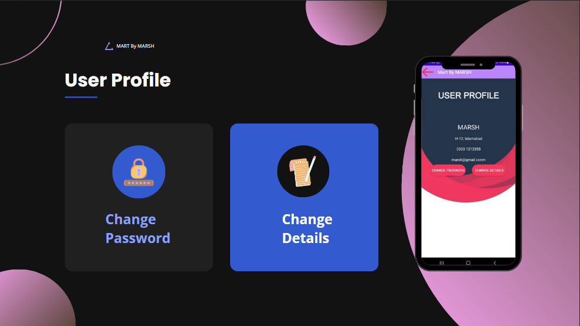

# Mart By MARSH

Mart By MARSH is a user-friendly Android application developed to enhance the shopping experience by allowing customers to browse categories and products, view detailed information, add items to a virtual shopping cart, and place orders seamlessly. This application, crafted using Android Studio, demonstrates proficiency in Android development, UI design, and backend integration.

## Application Overview

**_Developed with Android Studio, utilizing Java, XML, and Firebase._**

## 🚀 Objectives

👉 Provide an intuitive and seamless shopping experience for users.  
👉 Enable easy browsing and searching of product categories.  
👉 Facilitate efficient order placement and management.  
👉 Ensure secure user authentication and real-time data management.  

## Features and Functionality

📚 Browse and search for products across various categories.  
📚 View detailed information about each product.  
📚 Add items to a virtual shopping cart.  
📚 Place and track orders seamlessly.  
📚 Secure user authentication and profile management.  
📚 Real-time data synchronization with Firebase.  
📚 Responsive and visually appealing UI design.  

## Authentication

## Shopping Categories

## User Profile

## How to Build and Run

1. **Download and Install Android Studio:**  
   Ensure you have the latest version of Android Studio installed.

2. **Clone the Repository:**  
   Clone the project repository to your local machine.

3. **Open the Project:**  
   Open the project in Android Studio.

4. **Set Up Firebase:**  
   - Go to the Firebase console and create a new project.
   - Add your Android app to the Firebase project.
   - Download the `google-services.json` file and place it in the `app` directory of your project.

5. **Configure Dependencies:**  
   Ensure all necessary dependencies are included in your `build.gradle` files.

6. **Build the Project:**  
   Sync the project with Gradle files and build the project.

7. **Run the Application:**  
   Run the application on an emulator or physical device.

## Technologies Used

1. **Android Studio:** For application development.
2. **Java:** For backend development.
3. **XML:** For frontend design.
4. **Firebase:** For real-time data management.
5. **Git:** For version control.

## Note

Please let me know if you discover any bugs or have any suggestions.
